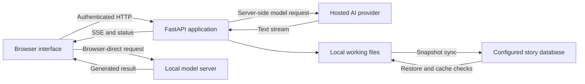

# Story Weaver

Story Weaver is a web application for writing continuing fiction with an AI model.
It combines a manuscript, a turn-by-turn conversation, editable reference files,
and automated continuity analysis. You supply the direction and the model
connection; Story Weaver assembles the context, streams the response, saves the
turn, and updates the story's reference material.

The backend is Python/FastAPI. The interface is HTML and JavaScript, with a
sectioned plain-text editor and keyboard-accessible controls. It can run on a
Windows PC or in one hosted application instance, including Render or ClawCloud
Run. PostgreSQL is the primary story store when configured; local files remain
the working copy used by the application.

**Documentation review:** 12 September 2026, against application commit
[`5ba3368`](https://github.com/surajpaswan123/story-weaver/commit/5ba336867414532030d454ed5fc78a9d2ba0537e).
This guide describes committed behavior. Provider catalogues, hosting offers, and
unpublished development changes are not promises about the running application.

**Start here:** [Writer's guide](#writers-guide), [installation](#installation),
[provider setup](#providers-and-models), or [returning to a running turn](#generation-recovery).

## Contents

- [What the application does](#what-the-application-does)
- [Installation](#installation)
- [Writer's guide](#writers-guide)
- [Revising, deleting, and retrying turns](#revising-deleting-and-retrying-turns)
- [File editor and keyboard reference](#file-editor-and-keyboard-reference)
- [Story files and practical examples](#story-files-and-practical-examples)
- [Context management](#context-management)
- [Providers and models](#providers-and-models)
- [Audio attachments](#audio-attachments)
- [Background analysis](#background-analysis)
- [Generation recovery](#generation-recovery)
- [Storage, synchronization, and backups](#storage-synchronization-and-backups)
- [Authentication, settings, and privacy](#authentication-settings-and-privacy)
- [Hosting and deployment](#hosting-and-deployment)
- [HTTP and streaming API](#http-and-streaming-api)
- [Performance and implementation limits](#performance-and-implementation-limits)
- [Troubleshooting](#troubleshooting)
- [Development and validation](#development-and-validation)
- [Frequently asked questions](#frequently-asked-questions)
- [Source map and project ownership](#source-map-and-project-ownership)

## What the application does

| Capability | Current behavior |
| --- | --- |
| Continuing fiction | Sends the full saved manuscript and reference context to the writer model. |
| Separate stories | Keeps story directories and requests associated with an account and story ID. |
| Turn revision | Regenerates the latest completed turn with the same prompt, an edited prompt, or explicit feedback. |
| Editable memory | Lets you edit Markdown reference files and `chat_log.json`. |
| Large-file editing | Keeps approximately 8,000 characters in the native textarea while retaining the complete document in a JavaScript buffer. |
| Provider compatibility | Supports native Google GenAI and server-side Chat Completions, Responses, and Anthropic Messages connections. |
| Local inference | Lets the browser call a local OpenAI-compatible Chat Completions server. |
| Audio input | Accepts uploaded audio, with separate hosted and browser-direct processing paths. |
| Continuity analysis | Updates reference files after turns and supports a manual analysis run. |
| Reconnection | Shows server-side generation status after a reload and loads the saved result when the turn finishes. |
| Hosted persistence | Saves complete story snapshots in PostgreSQL when `DATABASE_URL` is configured. |

The project is intended for long-context writing. A model with roughly one million
tokens of context is the intended starting point for a long manuscript, but the
application does not enforce that minimum or expand a provider's limits. Shorter
stories can use smaller context windows. Even a large-context model can miss a
detail, contradict a reference, refuse a request, or produce a poor continuation.
Reviewing the prose and maintaining accurate reference files remain part of the
writing process.

## Installation

### Requirements and deployment choice

Use Python 3.11 for consistency with the checked-in container image. Install the
packages from `requirements.txt`; no Node build is needed to serve the interface.
Node.js is needed for the frontend test commands later in this guide.

Choose where **Story Weaver itself** will run before configuring a model:

| Setup | Where the app stores its working files | Where inference happens |
| --- | --- | --- |
| App on your PC, hosted provider | Your PC; optional configured cloud stores | Provider server |
| App on Render/ClawCloud, hosted provider | Hosting instance plus configured persistence | Provider server |
| App on Render/ClawCloud, local provider | Hosting instance plus configured persistence | Model server reached by your browser |
| App and local provider on your PC | Your PC; optional configured cloud stores | Your local model server |

The last option reduces remote data movement, but the stock interface still loads
external frontend resources and uses Firebase sign-in. It is not a packaged,
fully offline desktop application. See the authentication and privacy sections
before treating any configuration as offline.

### Windows setup

Run these commands from PowerShell in the folder where you want the repository:

```powershell
git clone https://github.com/surajpaswan123/story-weaver.git
Set-Location story-weaver
py -3.11 -m venv .venv
.\.venv\Scripts\python.exe -m pip install -r requirements.txt
```

Configure Firebase for a working signed-in installation as described under
[authentication](#authentication-settings-and-privacy). Then start the backend:

```powershell
.\.venv\Scripts\python.exe main.py
```

With `PORT` unset, the normal address is
[http://127.0.0.1:8000](http://127.0.0.1:8000). Keep the backend process running
while using the app. Closing its terminal stops that local app instance and any
work it is performing.

After dependencies are installed, `Start_Story_Weaver.bat` is a convenience
launcher. It uses `.venv\Scripts\python.exe` if present, otherwise system Python.
It does **not** create the environment or install missing dependencies. It also
attempts to terminate a previous window titled `Story Weaver Backend` before
opening a replacement. Do not use it as a harmless status check while a turn is
running.

### macOS or Linux setup

```bash
git clone https://github.com/surajpaswan123/story-weaver.git
cd story-weaver
python3.11 -m venv .venv
source .venv/bin/activate
python -m pip install -r requirements.txt
python main.py
```

The same authentication, storage, and provider configuration applies. Running the
web server and running a model server are separate tasks; installing Story Weaver
does not install Ollama, download model weights, or provide a hosted API account.

### Configuration order

1. Get the backend serving `/ping` and the main page.
2. Configure Firebase Admin credentials and the matching browser Firebase project.
3. Add the site's hostname to that Firebase project's authorized domains and
   enable the intended Google sign-in provider.
4. Configure `DATABASE_URL` if story data must survive an ephemeral host restart.
5. Sign in, open Settings, and save a provider key together with its correct URL.
6. Refresh the model catalogue and select a model available to that key.
7. Create a small story and verify that writing, reopening, and file editing work.

The included `.env.example` contains only a legacy Gemini-key placeholder. It is
not a complete deployment template. Current interactive provider clients are
created from each user's saved Settings; putting a key in `.env` alone is not the
normal way to configure them.

## Writer's guide

### Start a story

Sign in and create a story using its name. The creation request takes a name, not
a separate premise field. Enter the opening premise in the story prompt after
creation. Names must include at least one ASCII letter or number. The backend
derives a normalized folder ID, so names that normalize to the same ID cannot
create two distinct stories in the same account.

Choose a provider below the prompt and then a model. For a custom gateway, the
provider may appear under the OpenAI/custom API connection even though the model
is not made by OpenAI. The name identifies the configured connection.

An opening instruction can specify the character, setting, viewpoint, and where
the scene should end:

> Begin at the flooded railway station. Mira has arrived to meet her brother,
> who has not answered her letters. Write in close third person from Mira's
> perspective. End when someone recognizes the seal on her envelope.

Press **Enter** in the main prompt to submit, or use **Shift+Enter** for a newline.
The file editor has its own shortcuts; Enter there edits the document normally.
Wait for the turn to finish saving and updating story memory before continuing.

### Maintain the story between turns

Use Story Files to inspect what the app and its models have recorded. A recurring
mistake often needs a correction in both the manuscript and the relevant
reference file. For example, correct a character's location in `positions.md`,
and check whether `story.md` contains contradictory prose that needs editing.

Keep permanent world facts in `rules.md`, writing preferences in `style.md`, and
temporary scene instructions in the prompt. This avoids repeatedly mixing
one-turn requests with rules intended to govern the whole book. A custom file
such as `magic.md` can hold an additional subject that does not fit the standard
categories.

Automatic analysis may update AI-maintained files again. User-authored rules and
style are not intended to be rewritten by that analysis. Saving a manual edit
changes the next context assembly; it does not automatically rewrite existing
chapters to make them agree.

### Browse and switch stories

The chat view initially loads a page of recent messages rather than the complete
transcript. Use its history controls to browse older turns. This affects what
the browser displays, not how much saved manuscript the writer receives.

Story changes clear the old view and cancel obsolete reads. Responses are checked
against the selected story before rendering, so a slow response from a story you
left should not replace the current story's turns or file contents. If a load
fails, inspect the displayed error rather than treating an empty panel as proof
that the underlying manuscript was deleted.

## Revising, deleting, and retrying turns

### Choose the action that matches the change

The revision controls apply to the **latest completed turn**. They are not a
branching editor for regenerating any arbitrary old scene while automatically
reconciling every later chapter.

| Action | Prompt used for the next generation | What happens first |
| --- | --- | --- |
| Regenerate | The original prompt | Undo the latest completed turn, then submit again. |
| Regenerate with feedback | The original prompt plus the removed draft, saved model thoughts, and feedback | Validate feedback, undo the latest turn, then send the revision context. |
| Edit & Redo | The edited version of the previous prompt | Confirm the edit, undo the latest turn, then generate from the edited prompt. |
| Retry failed prompt | The prompt returned from the pending retry record | Clear that retry marker and resubmit; do not undo an earlier successful turn. |
| Delete a turn | No new generation | Remove the selected transcript turn and try to remove its matching manuscript text. |

These actions change saved story data. Generation after an undo can itself fail;
the removed turn is not retained as an alternate branch that is automatically
restored on every failure.

### Regenerate with feedback, step by step

1. Open **Regenerate with feedback** beneath the latest completed response.
2. Enter the desired changes in the labelled feedback textbox.
3. Submit the feedback form. Cancelling the form leaves the turn alone.
4. The server obtains the original prompt and the removed AI response, checks
   that undo is safe, removes that response, and restores the latest available
   reference snapshot.
5. The next request includes the normal context and these explicit sections:

```text
Turn to replace:
<turn_to_replace>
The previous response's visible prose.
</turn_to_replace>

Model thoughts:
<model_thoughts>
Saved provider-returned thoughts, if any.
</model_thoughts>

Feedback:
<feedback>
Keep Mira's brother offstage. Make the porter evasive rather than hostile.
</feedback>
```

The instructions describe the removed draft and thoughts as revision references
that may contain mistakes. They ask for replacement story prose without these
labels. The references are not simply appended as canon to `story.md`.

`model_thoughts` stores reasoning text actually returned and captured by the app.
Legacy tagged text recognizes `<thought>`, `<think>`, `<thoughts>`, and the spelling
`<thaughts>`. If none was saved, the revision request says so. This feature does
not reveal private reasoning a provider did not return, and it does not invent
missing reasoning. Dedicated provider thinking blocks are not universally
preserved by every adapter.

### Undo boundaries

Undo checks that the latest saved AI prose can be removed safely from the end of
`story.md`. If you changed that prose directly, it can return HTTP 409 instead of
guessing which text to delete. Keep matching AI text in `chat_log.json` and
`story.md` consistent when editing them manually.

Reference snapshots are stored in the local `_snapshots` directory. There is one
latest snapshot, not one for every historical turn. It records reference
Markdown files before generation and removes newly created reference files when
restoring that snapshot. The manuscript is rolled back using the matching
transcript response, rather than being read from that reference snapshot.

Snapshots are not included in the normal PostgreSQL story-file sync. After a
host loses its local disk, saved story text may return from PostgreSQL while the
old reference snapshot is unavailable. Undo is therefore not a substitute for
backups or a full revision-history feature.

### Failed, dangling, and deleted turns

A trailing user prompt with no AI response is a *dangling prompt*. Ordinary undo
of that state drops the dangling prompt without deleting the previous successful
response. Feedback regeneration requires a completed response and rejects that
state. The cleanup action can remove trailing dangling prompts separately.

The pending retry file can retain a failed prompt and its feedback regeneration
context. It is local transient state, so it is not guaranteed to survive a
deployment restart. A retry creates a new provider request; it does not resume
an upstream model from its last streamed token.

Deleting an older turn does not restore the latest reference snapshot, because
that snapshot belongs to a different point in the story. If matching manuscript
text cannot be removed, the delete response reports a consistency warning. Review
the manuscript and affected references, then run analysis if needed. Later scenes
are not automatically rewritten around the deletion.

## File editor and keyboard reference

Open Story Files and select a Markdown file or `chat_log.json`. The editor offers
Copy, Copy all, Select all, Undo, Redo, Find, Replace, line navigation, word wrap,
section navigation, Save, and Download file. These are plain-text operations;
Markdown syntax remains editable text.

### Large documents and selection

The complete document stays in an in-memory text buffer. The native textarea
shows a bounded section of approximately 8,000 characters. Windows CRLF and CR newlines
are normalized to LF when a file is opened, matching native browser text editing.
Opening the file alone does not create an undo entry or mark it as edited.
Section boundaries avoid splitting UTF-16 surrogate pairs. A single huge line
is still divided into bounded sections.

Native typing can grow the visible section to 12,000 characters before it is
recentered around the cursor. This avoids repeatedly replacing the textbox text
while typing. Section descriptions update only when their text changes; typing
updates are coalesced, and ordinary selection keys do not rewrite descriptions.
The changing section counter is separate from the textbox description to reduce
repeated accessibility updates. Section navigation still announces its position.

**Ctrl+A selects the complete file logically**, even though only one section is
displayed. The status text announces that selection. Ctrl+C copies the complete
selection; cut, typing, and paste can replace the whole document. Arrow keys or
Escape leave that whole-file selection state. Ordinary selections made inside
the textarea refer to the visible section.

Use the dedicated whole-file selection and navigation controls for very long
documents. The app does not promise that every operating-system paragraph
selection gesture crosses section boundaries. For example, Ctrl+Shift+Down is
still influenced by the browser's native textarea behavior.

### Keyboard shortcuts

These bindings apply while the file textarea has focus. On platforms with a
Command key, the code also accepts that modifier for the Ctrl bindings.

| Shortcut | Result |
| --- | --- |
| Ctrl+A | Select the entire buffered file. |
| Ctrl+C | Copy the selected text, including a logical whole-file selection. |
| Ctrl+X | Cut the selection when the browser supplies clipboard access. |
| Ctrl+V | Paste plain text; a whole-file selection replaces the whole file. |
| Ctrl+Z | Undo a text edit in the current editor session. |
| Ctrl+Y or Ctrl+Shift+Z | Redo an undone text edit. |
| Ctrl+S | Call the file Save action. |
| Ctrl+F | Open the editor's find controls and focus the search field. |
| Alt+PageDown / Alt+PageUp | Move to the next / previous section. |
| Ctrl+Home / Ctrl+End | Move to the beginning / end of the complete file. |
| Enter in the Find field | Find the next match. |
| Enter in the line-number field | Jump to that line. |

Find searches the full buffer and can reveal a match in another section. Replace
changes the selected matching occurrence; it is not an undocumented Replace all
operation. A screen reader may need its normal forms/editing mode to pass these
keys to the textarea.

### Saving, downloading, and undo history

Save sends the complete buffer, not just the visible section. Markdown saves pass
through the app's text-cleaning function; transcript JSON is validated before
replacement. The raw file-save endpoint accepts up to **2,000,000 characters**.
That is a limit of this editing request, not a promise about maximum book length
or a provider's context window.

Download file includes the complete current buffer, including unsaved edits.
Downloading does not save those edits back into the story. Copy all likewise
works from the buffer. If the browser blocks clipboard access, focus the editor
and use Ctrl+C, or download the file. Copying an entire book still allocates a
large clipboard payload even though the textarea is sectioned.

The undo stack stores independent copies of changed text, so small history entries
do not retain entire older document strings. It groups adjacent typing and trims
older operations around a 20 MiB accounting budget or 500 operations. The newest
operation is retained even if it alone exceeds that budget. This is not a hard
cap on all browser memory. Opening another file or reloading resets editor
history; it is distinct from story-turn undo.

### Editing `chat_log.json`

The file must be a JSON array. Every entry needs `role` equal to `user` or `ai`
and a string `text`. Optional `model`, `time`, and `model_thoughts` values must
also be strings. Invalid JSON is rejected on save with useful validation details;
the server can report the line and column of a syntax error.

The editor supplies the original transcript as `expected_text`. If the transcript
changed while it was open, saving returns 409 so you can reload and apply the
edit to the new version. This check is specific to transcript editing; ordinary
Markdown saves do not offer the same compare-and-swap protection.

Changing chat history does not rewrite `story.md`, rebuild reference files, or
recount fictional events through an AI automatically. Keep those files aligned
deliberately, particularly when changing an AI response that undo must later
match against the manuscript.

## Story files and practical examples

A newly created story starts with `story.md` and the seven element files:
`characters.md`, `positions.md`, `villains.md`, `locations.md`, `incidents.md`,
`items.md`, and `time.md`. Other known files appear when used, saved, or generated.
There are fourteen recognized main file types, not a guarantee that fourteen
populated documents exist immediately after creation.

The examples below are authoring suggestions, not a mandatory Markdown schema.
Analysis uses model-generated sections and text heuristics; clear, stable naming
helps it maintain the files. Do not treat an AI-written reference as infallible
if it disagrees with what actually happened in the manuscript.

### File responsibilities

| File | Role and maintenance behavior |
| --- | --- |
| `story.md` | Continuous manuscript; generated visible prose is appended here. |
| `chat_log.json` | User/AI transcript, model labels, times, and captured thoughts. |
| `rules.md` | User-authored world constraints, emphasized separately in the writer prompt. |
| `style.md` | User-authored voice, viewpoint, tense, pacing, and formatting preferences. |
| `characters.md` | Cast and stable physical descriptions; main extraction normalizes and deduplicates character entries. |
| `positions.md` | Current physical locations; treated as a replacement snapshot during analysis. |
| `locations.md` | Established places and details; normally accumulates new information. |
| `items.md` | Possession and inventory records; also eligible for the hosted inventory pass. |
| `villains.md` | Current antagonist roster and status; treated as a replacement snapshot. |
| `incidents.md` | Events established in the story, with chronology where available. |
| `time.md` | Story days, times, and event ordering. |
| `summary.md` | Narrative summary material; normal analysis appends new paragraphs rather than enforcing a fixed-size rolling summary. |
| `consistency.md` | Diagnostic notes for the author, excluded from automatic writer context. |
| `audio_log.md` | Text records of shared audio and its analysis or related narrative snippet. |

### Manuscript and transcript

`story.md` contains prose such as:

```markdown
# Chapter One

Mira reached the station after the last bell. Water ran down the noticeboard,
blurring the departure times, but the porter had not moved from the locked gate.
```

The corresponding transcript is separate:

```json
[
  {
    "role": "user",
    "text": "Open at the flooded station. Mira is looking for her brother.",
    "model": "",
    "time": "18:20"
  },
  {
    "role": "ai",
    "text": "# Chapter One\n\nMira reached the station after the last bell. Water ran down the noticeboard,\nblurring the departure times, but the porter had not moved from the locked gate.",
    "model": "provider/model-id",
    "time": "18:21",
    "model_thoughts": ""
  }
]
```

The example times represent application clock strings, not in-story dates. Model
IDs are whatever the selected connection returns. Avoid putting a made-up model
ID into Settings just because a documentation example uses it.

### World rules and writing style

Put facts that must remain true into `rules.md`:

```markdown
## World Rules

- Messages cross the island by train or boat; there is no radio network.
- The northern bridge was destroyed before the opening scene.
- The envelope's seal identifies its sender, not its intended recipient.
```

Put prose preferences into `style.md`:

```markdown
## Style Guide

- Close third person from Mira's perspective, past tense.
- Keep dialogue direct and let silences carry tension.
- Establish space through sound, touch, movement, and other relevant senses.
- Avoid recapping the island's history in every scene.
```

World rules are instructions to the model, not a deterministic validation engine.
The optional rules/style pass can revise prose but cannot prove that every
constraint was followed.

### Characters, positions, and antagonists

Use stable descriptions in `characters.md`:

```markdown
## Characters

- Mira: adult courier; short dark hair, a scar on her left wrist, quiet voice.
- Arun: Mira's brother; tall, broad-shouldered, walks with a cane.
```

Keep current location separate in `positions.md`:

```markdown
## Current Positions

- Mira: under the station awning, outside the locked platform gate.
- Porter: behind the gate, within speaking distance of Mira.
- Arun: current location unknown; last confirmed at the east ferry office.
```

The writer receives an instruction to trust current positions over old mentions.
That helps establish the intended present scene; it does not guarantee that a
model will never contradict it. Do not convert an uncertain location into a
confirmed fact merely to fill a field.

`villains.md` can track current threats without assuming that every antagonist is
physically present:

```markdown
## Villains

- The inspector: active; searching for the missing dispatch ledger.
- Station enforcer: detained after the ferry incident; not at the platform.
```

### Places, objects, events, and time

`locations.md` should describe established geography and access:

```markdown
## Locations

- East station: a raised platform behind a lockable iron gate.
- Ferry office: across the market square; reachable on foot from the station.
```

`items.md` should record actual acquisition and current possession:

```markdown
## Items

- Sealed envelope: given to Mira at the ferry office. (Last: Mira's coat pocket)
- Brass gate key: used by the porter during the evening lock-up. (Last: porter)
```

`incidents.md` records events, while `time.md` records their timing:

```markdown
## Key Incidents

- (Day 1) Mira collected the sealed envelope before leaving the ferry office.
- (Day 1) Floodwater closed the lower station entrance.
```

```markdown
## Story Timeline

- Day 1, late afternoon: the lower station entrance flooded.
- Day 1, evening: Mira arrived after the last departure bell.
- Current position in time: Day 1, evening, continuing at the platform gate.
```

Preserve uncertainty if the prose gives only approximate timing. Clock-time
metadata in the chat log is not a replacement for this fictional chronology.

### Summary, diagnostics, audio, and custom references

`summary.md` can preserve a concise account of the narrative so far. It supplements
the full manuscript; it does not replace it in the writer request. Normal
analysis appends new summary paragraphs, so the file can grow over time. Review
repeated or contradictory summary material as part of manuscript maintenance.

`consistency.md` may contain a warning such as “The porter used a key after the
earlier scene said it was missing.” Treat that as a claim to investigate. It is
not itself an event in the fiction. The automatic context builder skips this
file. If you manually paste a warning into your prompt or another reference file,
you have explicitly added it to the model's context.

`audio_log.md` records text information about attachments. Hosted audio entries
include a narrative snippet and a limited excerpt of the objective analysis;
local native-audio entries identify that the local model heard the attachment.
It is not a complete transcription archive or storage for the audio bytes.

Additional simple Markdown files are picked up as labelled context. Good names
include `magic.md`, `factions.md`, or `relationships.md`. Automatic category
creation also has filters to avoid unsuitable or duplicate categories. The file
API accepts simple names with letters, digits, underscores, and hyphens, with no
path components or operating-system reserved names. `context.md` is excluded
from the automatic writer context despite being a Markdown file.

## Context management

### What the writer receives

The writer prompt contains application instructions, a description of the story
files, and the saved story context. The normal reference order is:

1. `characters.md`
2. `positions.md`
3. `locations.md`
4. `items.md`
5. `villains.md`
6. `incidents.md`
7. `audio_log.md`
8. `style.md`
9. `time.md`
10. `summary.md`
11. Additional eligible Markdown files, sorted by filename
12. The complete `story.md`

Empty or absent files are skipped. The assembled prompt also includes a parsed
current-time reminder when available and an emphasized world-rules reminder.
`rules.md` is read separately; its appearance in `SKIP_FILES` means “do not add
it as an ordinary reference section,” not “ignore world rules.” The current user
input is sent separately, with regeneration material appended when applicable.

`consistency.md` and `context.md` are excluded. `story.md` is also excluded from
the ordinary reference-file loop because it is appended explicitly as the full
manuscript. The same intent applies to hosted text, hosted audio, and the prompt
assembly returned for local browser generation.

The ordering makes the continuation point explicit. It is a prompt-design choice,
not a proof about attention weights or a guarantee that the model will obey every
reference. The actual model response remains dependent on its capabilities and
the provider's handling of the request.

### Full manuscript versus displayed history

The chat page size, manuscript preview size, and file-editor section size are
presentation and resource controls. They do not truncate the full manuscript
sent to the writer. `chat_log.json` is used for transcript display, turn counts,
recent-turn extraction, undo, and saved thought metadata. The entire transcript
is not separately replayed as a duplicate user/assistant conversation on every
ordinary writing request.

There is no vector database, embedding search, automatic context-budget planner,
or sliding-window replacement for the manuscript in this implementation. The
presence of `summary.md` does not mean old chapters are removed from the prompt.
There is also no automatic certification that a discovered model supports a
million-token input.

As a manuscript grows, include the references, system instructions, feedback,
and required output allowance when evaluating the model's context capacity.
For a long-context story, select suitable background and rules models as well
as a suitable writer: those stages have their own requests and limits.

### Imported and heavily edited manuscripts

To continue existing work, create a story and save the manuscript in `story.md`.
Add the important rules and style preferences. Run whole-story analysis to help
bring references up to date, then review its file changes before generating a
continuation. This does not synthesize a complete historic conversation from the
imported prose. If no transcript exists, the chat view can show a manuscript-tail
preview instead of a list of original turns.

Do not invent transcript entries just to make the history look full. If you need
to import genuine turn history, use valid JSON and keep the AI text aligned with
the manuscript. Analysis cannot recover an unavailable original prompt, model
label, or thought block from prose alone.

## Providers and models

### Saved connections and pipeline choices

The standard Settings fields expose Google Gemini, OpenAI/custom API, OpenRouter,
Groq, and NVIDIA NIM keys. Browser-direct local servers have their own settings.
Other provider helper names exist in the backend, but their presence alone does
not mean the standard UI supplies a complete dedicated configuration for them.
An OpenAI-compatible service may be usable through the custom API connection.

Save the key and URL belonging to the **same provider account**. A valid key from
one gateway is not automatically valid on another. Changing a custom key or URL
refreshes model discovery and clears unchanged pipeline selections tied to the
previous OpenAI connection. Choose the replacement model after saving.

| Pipeline setting | Purpose |
| --- | --- |
| Story Model | Preferred writer for the main continuation. |
| Background Model | Reference extraction and continuity work. |
| Rules Model | Optional rules/style post-editing. |
| Audio Model | Audio understanding for the applicable attachment path. |

Saved hosted overrides encode both connection and model, for example
`openai::MODEL_ID`. The provider/model controls by the prompt select the current
writing request. Background, rules, and audio choices are separate; changing the
writer does not necessarily change every other stage. Default/Auto uses the
available candidates and fallback logic in the app, not a fixed universal model.

### Custom URL and API format

The custom connection accepts an API base or a complete endpoint. Path prefixes
are retained. A provider hosted at `/gateway/v1` should keep that prefix.

| Saved URL example | Auto interpretation |
| --- | --- |
| `https://provider.example/v1` | Chat Completions, unless a supported special case applies. |
| `https://provider.example/v1/chat/completions` | Chat Completions; use the parent as the API base. |
| `https://provider.example/v1/responses` | Responses; use the parent as the API base. |
| `https://provider.example/v1/messages` | Anthropic Messages; use the parent as the API base. |
| `https://api.anthropic.com/v1` | Messages, recognized by the hostname. |

The stored format values are `auto`, `chat_completions`, `responses`, and
`messages`. On ordinary custom connections, an explicitly selected format
overrides suffix detection. **Auto is not a universal gateway probe.** A bare
`/v1` gateway that expects Responses needs the Responses setting or a URL ending
in `/responses`.

Server-side custom URLs must use HTTPS, omit embedded credentials, query strings,
and fragments, and pass the public-address validation. Localhost and private
network destinations are rejected in this field. Use the separate browser-direct
local-server feature for a model on your computer. The custom provider transports
do not follow redirects; configure the final API address instead of a redirecting
homepage.

### Chat Completions, Responses, and Messages

The adapters in [openai_compat.py](openai_compat.py) normalize text results for the
rest of the application:

| Format | Request shape | Relevant implementation behavior |
| --- | --- | --- |
| Chat Completions | `model`, `messages`, streaming options | Uses the OpenAI-compatible chat interface. |
| Responses | `model`, `input`, optional `reasoning.effort` | Converts the app's messages into `input`, defaults `store` to false, and rejects incomplete/empty results. |
| Messages | `model`, top-level `system`, conversation `messages`, required `max_tokens` | Uses Anthropic request types and extracts visible text; handles incompatible stop outcomes as errors. |

The Responses and Messages adapters omit some sampling defaults that reasoning
endpoints reject. This is compatibility handling, not support for every option in
every vendor API. Native tool execution, all multimodal combinations, and every
provider-specific reasoning field are not implied by supporting a text format.

### Output limits and reasoning effort

The custom maximum-output setting is used for **Anthropic Messages requests**.
Messages requires a positive `max_tokens` value. With the field empty, the app
uses a positive `max_tokens` advertised in the discovered model metadata when
available; otherwise it requests **131,072**. With a configured value and an
advertised limit, it uses the smaller of the two.

The setting accepts positive whole numbers up to 2,147,483,647, but that is only
input validation. It is not a supported output length for any particular model.
A provider can reject a requested maximum above its own limit. If that happens,
set the field to the limit documented for the exact model and endpoint.

A maximum output allowance does not force the model to write that many tokens or
set a minimum response length. Models can finish earlier. Reaching an enforced
maximum can terminate output; the Messages/Responses adapters surface known
incomplete outcomes instead of treating all truncated responses as normal
success. Some other paths also trim an unfinished final sentence during cleanup.

Responses reasoning-effort options accepted by Settings are default/empty,
`none`, `minimal`, `low`, `medium`, `high`, and `xhigh`. Acceptance by Settings does
not establish support by the chosen provider. This field is not an Anthropic
thinking-budget control and does not expose reasoning that the provider withholds.

### Model discovery and missing models

The catalogue is fetched from the configured provider, not from a fixed list in
the README. The custom connection requests `<normalized-base>/models` with the
matching credential. Messages discovery uses `x-api-key` and an Anthropic version
header; ordinary compatible gateways use Bearer authentication. Supported
Messages catalogue pagination is followed with bounded cursor requests.

The response records whether each configured connection has a ready, empty, or
failed catalogue. A saved connection stays selectable even if discovery fails.
When the provider supplies no list, the interface can offer a manual exact model
ID. This is useful for gateways that support generation but do not implement
`/models`. It does not verify that the entered model exists or is accessible.

Use **Refresh models** after saving connection changes. If an old model remains
unavailable, select a current model or reset its pipeline override to Default.
Discovery filters likely non-chat models using naming/capability heuristics, so
a model listed by the provider can still be filtered from a story selector.
Conversely, appearing in a catalogue does not prove that a model accepts your
account's generation request, audio format, or chosen context length.

Examples in this guide intentionally avoid asserting that a particular model ID
is currently free or available. Copy the exact model ID returned for your key;
suffixes such as `contributor` or `free` can distinguish separate products.

### OpenCode Zen special case

For the recognized base `https://opencode.ai/zen/v1`, the adapter chooses a format
on each call using its implemented model-family rules:

| Model-name prefix | Route in the current code |
| --- | --- |
| `muse-spark-`, `gpt-`, `grok-` | Responses |
| `claude-`, `qwen` | Messages |
| `gemini-` | Recognized as requiring Google format; rejected by this compatible adapter. |
| Other prefixes | Chat Completions |

This is a specific router for the recognized Zen host and path, not a guarantee
that a different proxy uses the same mapping. Model availability still comes
from authenticated discovery. Renamed or newly introduced model families can
require adapter changes; the catalogue and the protocol mapping are separate
concerns.

### Multiple keys and retries

Provider key input supports multiple keys separated by lines, whitespace, commas,
or semicolons. The backend deduplicates them and can try another configured key
through its failover client. Masked values are displayed individually; blank
secret fields preserve stored keys, and explicit clear controls remove them.

Transient failures can retry the same model up to twenty times. The delay schedule
starts at two seconds and rises to sixty seconds, with jitter. Rate limits,
overload, and some network failures are treated differently from invalid keys,
unsupported models, and invalid requests. Several pipeline/fallback layers exist,
so this is not a strict upper bound on total requests or elapsed turn time.

Once an SSE response has started, provider errors are usually communicated as
events inside that stream. The outer HTTP response may already be 200. Do not
assume every upstream 429 becomes an HTTP 429 from `/generate`.

### Browser-direct local models

Enable the local server setting, give it a name, enter its base URL, and save it.
For example, a normally configured Ollama server uses
`http://localhost:11434/v1`. Other servers can use different ports and paths;
enter the URL at which they expose their OpenAI-compatible API.

The browser requests `/models` and `/chat/completions` from that base. It does not
use the server-side Responses or Messages adapter. Supply a base URL, not a full
`/chat/completions` URL, because the browser appends the endpoint itself. An
optional local API key is returned to your signed-in browser so those direct
requests can authenticate.

Here, `localhost` means the computer running the browser. The model server must
permit the Story Weaver origin through its CORS configuration, and the browser's
network policies must allow the connection. Ollama documents `OLLAMA_ORIGINS` for
additional permitted origins in its [official FAQ](https://docs.ollama.com/faq).
Use the specific Story Weaver origin rather than a blanket wildcard when possible.

The app still sends local-begin/local-finish requests to the Story Weaver backend
to assemble context, reserve a turn, and save the result. With hosted Story Weaver,
this is local **inference**, not local-only story storage. A browser reload or
shutdown interrupts the browser-driven pipeline. Do not expect the hosted server
to continue calls it was never executing.

## Audio attachments

### Attach a file

Use **Attach audio** beside the prompt, choose a recording, and provide the
desired story direction. This is a file attachment flow, not a built-in live
microphone recorder. You can remove the selected attachment before submitting.

The backend limit is **25 × 1,024 × 1,024 bytes** per audio upload, displayed as
25 MB in the interface. The supplied MIME type must begin with `audio/`.
Acceptance of the upload does not prove that the selected model can decode its
codec. MP3, WAV, M4A, and OGG are examples of audio files, not a guarantee that
every configured model accepts every one of them.

### Hosted audio pipeline

The hosted path has three main roles:

1. **Audio understanding:** analyze the attachment without the story context,
   seeking objective speech, music, mood, and sound information.
2. **Story writing:** combine the resulting audio notes with the story context
   and user direction.
3. **Rules/style refinement:** optionally check the resulting prose against the
   configured rules and style.

This separation reduces the opportunity for the transcription stage to borrow
details from the fiction. It does not guarantee an exact transcript. An unavailable
audio analysis can produce a notice instead of detailed notes, and provider/model
capabilities affect which path can succeed. Configure an audio-capable model for
the audio stage; the writer need not necessarily decode the original sound.

The result is saved as a normal story turn, and a text record is added to
`audio_log.md`. Automatic background analysis can still follow. Consequently,
“three stages” does not mean exactly three model calls per turn: retries and
additional inventory/verification work may add calls.

### Local audio and persistence limits

The local audio path prepares the turn and attachment through the app backend,
then has the browser send native audio to a compatible local model. The local
model must support the request's audio representation; text-only Chat Completions
support is insufficient. Local settings include separate pipeline model choices.

Audio files and temporary media are not part of the ordinary top-level Markdown/
JSON story snapshot uploaded to PostgreSQL. The text in `audio_log.md` can survive
a successful story sync while an uploaded audio file does not survive loss of the
host's local disk. Keep the original attachment if it is important to your work.

## Background analysis

### Automatic analysis

The current `BATCH_SIZE` constant is 1, so normal hosted generation runs analysis
after each completed turn. It is a code constant, not a Settings field. The prose
is committed before analysis finishes, and the UI can show **Updating story
memory** during this finalization stage. The main turn waits for that analysis
thread before declaring its normal completion.

Analysis extracts or updates categories, appends summary material, and records
consistency notes. `positions.md` and `villains.md` are treated as current-state
replacement files; many other categories accumulate new material. Additional
inventory and reference-verification passes can run on the hosted path. Small
or malformed model output may be skipped rather than replacing useful files.

This is background work relative to the displayed prose, not a separate permanent
worker service or an autonomous daemon that continuously scans all stories. It
is triggered by a turn or a manual request within the same app process.

### Manual repair and status

Manual analysis accepts a scope:

| Scope | Meaning |
| --- | --- |
| `turns=0`, the default | Treat the whole manuscript as the text to analyze. |
| `turns=N`, with N positive | Treat the most recent N AI turns as new material. |

Whole-story analysis is useful after importing prose or repairing stale reference
files. It does **not** erase every reference and rebuild the entire story database
from nothing. Existing files and the normal category update rules still matter.

The status endpoint reports the selected model, stages, files written, errors,
and elapsed time. Its states include `idle`, `running`, `done`, `partial`, and
`failed`. A partial run may have updated some files before another stage failed.
“Analysis started” is an acknowledgement, not evidence that all updates succeeded.

The committed API at the review revision does not include a public
`cancel-analysis` route. Generation Stop is not a promise of a complete rollback
of analysis already written to disk. Check the actual analysis status before
assuming a reference update was cancelled or undone.

### Browser-direct analysis

For local generation, the browser requests the analysis prompt, calls the local
model, and sends its structured result back to the backend. That result uses
the app's analysis parser and file-writing rules. The additional server-side
inventory and verification model calls are skipped for this local-output path.
The browser must remain available through these steps and release the turn at
the end.

Diagnostic notes remain separate from writer context. Review a reported problem
against the manuscript, correct the actual file or prose when appropriate, and
avoid copying diagnostic language into canonical references as if it were an event.

## Generation recovery

### Returning after a disconnect

Hosted generation runs in a worker thread separated from the browser's stream
reader. Closing the page or losing the browser connection does not automatically
stop that worker. While the same app process remains alive, it can complete the
provider call, save the turn, update references, and attempt the final cloud sync.

After a signed-in reload, the interface remembers the last selected story for
that account in that browser, validates it against the returned story list, and
loads it. It reads generation status alongside history and continues checking
while a recovered turn is active. Finished saved history is loaded automatically.

| State | What it means |
| --- | --- |
| `idle` | No current/recent progress record is available for this story in this process. |
| `starting` | A turn has been reserved. |
| `generating` | The server worker is executing the generation pipeline. |
| `retrying` | A retry event was observed. |
| `finalizing` | The pipeline is finishing work such as reference updates and cleanup. |
| `completed` | The tracked turn ended with a completion outcome. |
| `failed` | The tracked turn ended with an error outcome. |
| `stopped` | The turn was marked stopped. |
| `interrupted` | A tracked reservation ended without a normal final outcome. |

Recovered controls include **Check generation status** and **Stop generation**.
If a status request fails, the interface explains that work may still be running
instead of immediately enabling a duplicate submission. Old status responses are
ignored after switching to another story.

### Cost and timing of status checks

The status endpoint reads small in-memory metadata. It does not load the
manuscript, query PostgreSQL, or call an AI model. Automatic checks occur roughly
every three seconds for an active visible page and fifteen seconds in a hidden
tab. Failure backoff rises to thirty seconds. Requests do not overlap, and
switching stories clears the old monitor.

Progress stores the execution mode, state, timestamps, and a public run ID, not
prompts or streamed prose. Finished records are limited to 128 and expire after
about one hour; active records are retained. The run ID is not the secret token
required by browser-driven turn operations.

### What recovery cannot do

The registry and active workers are process-local. A Render restart, deployment,
process crash, or container replacement can end the provider request and erase
the progress record. The app does not have a persistent job queue or a mechanism
to restart an interrupted generation from its last token. After a restart, an
idle status cannot reconstruct the fate of every earlier request.

Recovery does not replay already-streamed unsaved text. It watches status and
loads saved results. A completion state also does not independently certify that
the last PostgreSQL upload succeeded; storage failures are discussed below.

For browser-direct generation, status identifies `execution: "browser"`. It
means the app is waiting for the originating browser, not that a hosted worker
is writing on its behalf. Reservations without an active server worker expire
after thirty minutes without renewal through the local pipeline. A live server
worker is protected from that reservation timeout.

Stop is cooperative: the app sets a flag and performs its stop cleanup, but it
cannot guarantee immediate termination of a provider's computation or charges.
Text already committed before a late stop, and completed analysis updates, are
not covered by a universal transactional cancellation guarantee.

## Storage, synchronization, and backups

### Three distinct kinds of state

It helps to distinguish working files, cloud story snapshots, and transient
runtime state. They have different recovery properties:

| State | Location | Survives replacement of an ephemeral app instance? |
| --- | --- | --- |
| Successfully synced story Markdown and transcript JSON | PostgreSQL when configured; otherwise legacy Firestore when available | Yes, subject to the external store remaining available. |
| Working story files | `stories/<normalized-uid>/<story-id>/` beside `main.py` | Only with a persistent disk or a successful remote copy. |
| Newer files whose upload failed | Local working directory with pending-upload metadata | Not without preserving that local disk. |
| Latest reference undo snapshot | Local `_snapshots/` subdirectory | Not through the normal story snapshot sync. |
| Failed prompt/revision retry marker | Local `pending_retry.json` | Not through the normal story snapshot sync. |
| Uploaded audio | Local media files | Not through the normal story snapshot sync. |
| Active generation and recent progress | Python process memory | No. |
| Last selected story | Account-scoped browser localStorage | Only in that browser profile, until cleared. |

The ordinary local layout is:

```text
stories/
  <normalized-user-id>/
    user_keys.json
    <story-id>/
      story.md
      chat_log.json
      characters.md
      positions.md
      ...other story Markdown files...
      _sync_meta.json
      pending_retry.json       (when a retry is pending)
      _snapshots/
        manifest.json
        ...latest reference snapshot...
```

For local/default-user compatibility, the app can also recognize older direct
`stories/<story-id>/` directories. The local fallback user is `default_user`, not
an automatically created `local_admin` account. Default-user story operations
skip the normal per-account remote sync.

### Which store is authoritative?

For signed-in story data, configuring `DATABASE_URL` selects PostgreSQL as the
primary store, even if its startup connection failed. The restore path will not
silently substitute an older Firestore document when the selected PostgreSQL
database is temporarily unavailable.

If a local working copy exists, some failed remote reads can continue using it.
Without a usable local copy, a PostgreSQL restore failure returns 503. If no
PostgreSQL URL is configured, an initialized Firestore connection can provide
the legacy story store. Without either, story data remains local to the app.

Function names such as `sync_story_directory_to_firestore` are historical. They
now select PostgreSQL when it is configured. Do not infer the active storage
destination from the function name alone.

### Actual PostgreSQL schema

Startup creates these two tables if necessary:

```sql
CREATE TABLE IF NOT EXISTS user_keys (
    uid VARCHAR(255) PRIMARY KEY,
    keys JSONB NOT NULL,
    updated_at DOUBLE PRECISION DEFAULT 0
);

CREATE TABLE IF NOT EXISTS user_stories (
    uid VARCHAR(255) NOT NULL,
    story_id VARCHAR(255) NOT NULL,
    file_name VARCHAR(255) NOT NULL,
    content TEXT NOT NULL,
    updated_at DOUBLE PRECISION NOT NULL,
    title VARCHAR(255),
    PRIMARY KEY (uid, story_id, file_name)
);
```

`user_stories` holds one row per file, not one row per chat message. Files include
`chat_log.json` as text. A snapshot write takes a transaction-level advisory lock
for the account/story pair, upserts all included files with one timestamp, and
deletes stale file rows before committing. No separate job table, transcript table,
or extra lookup index is created by the application.

A warm local cache can check the remote filename/timestamp manifest before
downloading all content again. Missing or changed files cause a full snapshot
read. This reduces repeated large transfers when opening several panels, but
the application is not a permanently database-free cache.

### Atomic writes and their limits

Local text and JSON helpers write a temporary file, flush it, and replace the
destination. `commit_ai_turn` writes the manuscript and transcript under the
story lock and attempts to restore the original manuscript if the transcript
write fails. That is useful protection against ordinary write failures.

It is not one distributed transaction spanning local files, PostgreSQL, Firestore,
the provider, and browser state. Sudden process or machine failure between local
file operations remains different from a handled exception. Background analysis
also writes files in stages before the later complete snapshot sync.

The PostgreSQL **snapshot transaction** is atomic within that database. If it
fails, the new local files may still exist while the remote database retains the
previous version. The sync function records `pending_upload` locally and returns
failure; several user-facing save routes do not convert that failure into an HTTP
error. A successful file Save response or a completed generation indicator is
therefore not independent proof of successful remote persistence.

When an upload is pending, restore avoids overwriting those newer local files
with an older remote snapshot. Later saves can attempt synchronization again,
but there is no dedicated durable retry queue or guaranteed automatic uploader.
Preserve the local files before restarting an ephemeral instance if logs report
a cloud sync error.

### Legacy Firestore migration

A story with no PostgreSQL rows may be imported from legacy Firestore **after a
successful empty PostgreSQL read**. The import writes only if the primary story
is still absent, then rereads the authoritative rows. A primary-store outage does
not count as proof that the primary story is absent.

Firestore-only story snapshots place multiple files into one document. Firestore
limits a document to 1 MiB (1,048,576 bytes), including its document overhead; a
large manuscript plus transcript can exceed that limit. PostgreSQL file rows
avoid that particular single-document constraint. See the
[official Firestore limits](https://firebase.google.com/docs/firestore/quotas).

When PostgreSQL is configured, ordinary story saves no longer also push the full
story into Firestore. **Settings use a separate path** that can still read/write
both systems. Migration does not automatically delete legacy Firestore records,
and it is not a complete backup or an assurance of zero data loss.

### Backup and restoration planning

For a portable manuscript, open `story.md` and use Download file. For enough data
to reconstruct the working story, preserve the transcript and all reference
files too. A manuscript download alone does not include prompts, settings,
thoughts, or undo snapshots.

An operator backup should account for the database and local-only state. Database
backups include `user_keys`, which can contain credentials; treat the backup as
sensitive. Retain provider/database backups according to the deployment's needs,
and verify restoration into a separate destination before relying on a procedure.

For an existing local disk copy, stop edits and wait for work to finish before
taking a consistent directory-level copy. Preserve user directory names so the
restored files map to the same accounts. Do not merge unrelated users' folders
or replace a newer pending-upload working copy with a stale remote export.

When moving hosts, use the same intended Firebase project and database, verify
the new host's reads and saves, and avoid editing the same story through both
instances at once. PostgreSQL's snapshot lock serializes individual writes; it
does not provide shared generation reservations across app instances.

## Authentication, settings, and privacy

### Hosted sign-in

The browser uses Firebase Authentication and attaches a Firebase ID token to
authenticated requests. The backend verifies it with Firebase Admin. A missing
or invalid sign-in can result in guest access; persistent mutations use
`require_authenticated_user` and reject guest callers with 403.

For your own deployment, configure both sides of the same Firebase project:

- Backend: service-account JSON in `FIREBASE_SERVICE_ACCOUNT_JSON`, or a credential
  file selected by `FIREBASE_CREDENTIALS_FILE`. Application Default Credentials
  are also attempted when explicitly configured.
- Browser: the Firebase web-app configuration used by `window.FIREBASE_CONFIG`
  or the fallback object in `static/index.html`.
- Firebase console: enable Google sign-in and authorize the deployed hostname.

The browser web-app configuration is distinct from a private Admin service-account
key. Never place the Admin JSON in frontend code. For a fork, replacing only the
backend credentials while leaving another project's browser configuration will
not create a matching sign-in setup.

### Local compatibility switches

`ALLOW_LOCAL_SUPER_ADMIN=true` enables an unauthenticated backend fallback only
outside a detected hosted environment. It uses the default-user workspace. It
does not implement a new offline login screen or guarantee that the stock UI
removes its guest restrictions.

`ALLOW_UNVERIFIED_JWT` is a local-development compatibility setting. Verified
Firebase tokens are required when Firebase is initialized or the app detects a
hosted environment. Its automatic local behavior is not an appropriate public
authentication configuration.

The presence of `PORT` is one hosted-environment signal, along with several
hosting-specific variables. Setting `PORT=8000` in a supposed local-bypass recipe
therefore disables those hosted-prohibited fallbacks. Keep the public deployment
flags false and configure real Firebase verification rather than attempting to
make a hosted service accept unverified tokens.

### What masking and local inference mean

Cloud provider keys are saved in local `user_keys.json` and, when available, the
configured settings stores. The UI normally receives masked cloud keys. The
implementation does not encrypt those values itself at rest. File permissions,
database access, backups, and hosting account access are operational concerns.

The local-server API key is deliberately returned in full to the authenticated
browser for direct model requests. It is also part of saved settings. This is
different from the server-side provider keys used only by the backend.

Story content can be processed by the app host, the configured database services,
and the chosen AI providers. Hosted audio can send attachment data to an audio
provider. Provider retention, training, and billing policies depend on the actual
service and account; Story Weaver cannot promise them on every provider's behalf.

The stock page loads Tailwind and Firebase resources from external CDNs. Local
inference alone does not remove those network dependencies. There is no end-to-end
encryption feature that keeps story text unreadable to the app operator.

### Logs and accessible controls

`/api/logs` currently exposes the recent server log buffer to guests as well as
signed-in users. Non-super-admin responses apply a limited set of secret-pattern
redactions; the configured super-admin sees raw lines. This is not per-story log
isolation or a guarantee that every sensitive value is removed. Avoid inserting
credentials or unnecessary private content into diagnostic messages.

The interface includes native buttons, labelled editing controls, keyboard tab
navigation, expandable model-thought sections, and live status announcements.
Those implementation choices support nonvisual use. The project does not claim
a completed WCAG conformance audit, universal screen-reader compatibility, or
that every modal has been independently verified for focus trapping. Report a
specific inaccessible control or keyboard sequence so it can be tested directly.

## Hosting and deployment

### One application process and one instance

Run one app process in one instance. Story locks, active-turn reservations,
analysis status, and generation progress are held in memory. Multiple Uvicorn
workers or replicas can disagree about which story is active. Sharing PostgreSQL
does not turn those registries into distributed locks.

The app runs the model API calls and coordinates persistence; it does not host
large model weights itself. A small instance may be sufficient for light use,
but full-context generation, audio encoding, and simultaneous stories still use
memory and CPU. There is no validated promise that any book fits a fixed small
RAM allocation.

### Runtime configuration

| Variable | Purpose and behavior |
| --- | --- |
| `HOST` | Bind address. Defaults to loopback locally or `0.0.0.0` when `PORT` is set. |
| `PORT` | Listening port, default 8000; also contributes to hosted-environment detection. |
| `RELOAD` | Development reload, default false. Keep false on hosted deployments. |
| `DATABASE_URL` | PostgreSQL connection URL and selector for primary story storage. |
| `FIREBASE_SERVICE_ACCOUNT_JSON` | Complete private Firebase Admin service-account JSON. |
| `FIREBASE_CREDENTIALS_FILE` | Credential file path; defaults beside `main.py` to `firebase-credentials.json`. |
| `GOOGLE_APPLICATION_CREDENTIALS` | Optional explicitly configured credentials for the initialization fallback. |
| `SUPER_ADMIN_EMAIL` | Email treated as the administrator; review the source default for a fork. |
| `ALLOW_LOCAL_SUPER_ADMIN` | Local-only backend compatibility fallback; false in the image. |
| `ALLOW_UNVERIFIED_JWT` | Local-only token-decoding compatibility; false in the image. |
| `TRUST_PROXY_HEADERS` | Controls use of forwarded client-IP headers; leave false unless the proxy behavior is understood. |

Set secrets in the host's environment/secret configuration. Do not bake local
`.env`, account JSON, story files, or API keys into an image. A healthy `/ping`
does not verify any of these credentials.

### Container image and GitHub connection

[Dockerfile](Dockerfile) uses Python 3.11, installs runtime requirements, and runs
as UID/GID `10001:10001`. Its working directory is `/app`, the writable story
directory is `/app/stories`, and the default exposed port is 8000. It includes a
health check against `/ping`.

The [image workflow](.github/workflows/publish-image.yml) builds from committed
application files, runs selected frontend checks and a container startup/auth
smoke check, then publishes:

```text
ghcr.io/surajpaswan123/story-weaver:main
ghcr.io/surajpaswan123/story-weaver:<full-application-commit-sha>
```

Use a tag from a **successful image build**. The full-commit tag identifies the
exact application revision; `main` is a moving tag. The workflow is path-filtered,
so a README-only commit does not automatically create an image bearing that new
commit SHA. The workflow also supports manual dispatch on main.

Linking GitHub to a hosting account and publishing an image are separate from
deploying that image. Confirm the service's actual deployment integration rather
than assuming a successful Git push moved a running container to a new version.

If using a volume, mount it at `/app/stories` and make it writable by UID/GID
10001. Mounting over `/app` hides the application. A persistent volume protects
local-only state, but it does not replace database backups or solve multi-instance
coordination.

### Render

For a source-based Render Web Service, use:

| Setting | Value |
| --- | --- |
| Build command | `python -m pip install -r requirements.txt` |
| Start command | `python main.py` |
| Health check path | `/ping` |
| Application instances/processes | One |
| Runtime secrets | Matching Firebase configuration and the intended PostgreSQL URL |

The existing project site is
[Story Weaver on Render](https://story-weaver-m47x.onrender.com/). Deploying an
update to that service does not require creating another Story Weaver service.

Render's free-service documentation describes idle spin-down after fifteen
minutes and an ephemeral filesystem that loses changes on restart, redeploy, or
spin-down. A free service can also restart independently of browser activity.
Successful remote persistence matters more than keeping a browser tab open.
See [Render's current free-service limits](https://render.com/docs/free).

### cron-job.org and `/ping`

Point a scheduler at the lightweight endpoint on the same app:

```text
https://YOUR-SERVICE/ping
```

Use GET without an API key. A running instance responds with HTTP 200, plain text
`OK`, and a two-byte body. HEAD is also supported without a response body. The
endpoint does not download stories, authenticate a user, or contact providers.

This avoids downloading the entire HTML page for every scheduled request. A
ten-minute interval is an example configuration, not a guarantee of uninterrupted
hosting. Host cold starts, network failures, scheduler timeouts, usage limits,
and platform restarts can still affect a job. `/ping` is a liveness check, not a
story backup, database health check, or generation-resume service.

### ClawCloud Run

The companion [ClawCloud deployment guide](docs/clawcloud.md) describes the
container-image flow. Sign-in is at [ClawCloud Run](https://run.claw.cloud/).
Use an image from a successful GitHub build, one fixed instance, container port
8000, and the existing intended Firebase/PostgreSQL configuration.

The documented 0.5 vCPU / 1 GB allocation is a deployment starting point, not a
guaranteed free entitlement or a benchmark for every workload. Check the current
console's resource estimate, credit eligibility, storage, and traffic charges
before launching. This README does not create a ClawCloud app or move an existing
Render service by itself.

After obtaining a new hostname, add it to the matching Firebase project's
authorized domains. Verify sign-in, existing-story load, a save, and subsequent
reopen. Avoid using Render and ClawCloud concurrently to edit the same story,
because their generation locks cannot see each other.

### Release verification

Separate these checks when assessing a deployment:

1. **Build:** did the image/source build succeed for the intended revision?
2. **Process:** does `/ping` return the app's `OK` response?
3. **Application version:** does the served page/API schema contain the intended
   change, rather than an older deployment or cached page?
4. **Authentication:** can the intended account sign in, while guest writes are
   rejected?
5. **Persistence:** can that account save and reopen a disposable story, with
   successful remote sync when cloud persistence is expected?

Only the last checks exercise real account/storage configuration. Do not report
that all user stories are safe merely because a container started or an anonymous
health endpoint returned 200.

## HTTP and streaming API

### Conventions

FastAPI exposes interactive documentation at `/docs` and its generated schema at
`/openapi.json`. Those describe the server you are actually contacting. `/ping`
and `/favicon.ico` are intentionally omitted from the generated schema.

For hosted authenticated operations, use:

```http
Authorization: Bearer FIREBASE_ID_TOKEN
Content-Type: application/json
```

That token is a **Firebase sign-in token**, not an AI provider API key. Provider
keys belong in the account's Settings. The backend selects the account from
authentication; adding somebody else's UID to a body is not the documented way
to select their stories.

In the tables, **signed in** means the route uses the persistent-mutation auth
guard. **Scoped read** means it uses the current-user/default/guest identity
resolver rather than requiring sign-in. A readable guest route does not mean
it is a public directory of every account's stories.

### Story and file endpoints

| Method | Path | Access | Request or result |
| --- | --- | --- | --- |
| GET / HEAD | `/ping` | Public | Liveness response; GET body is `OK`. |
| GET | `/stories` | Scoped read | `{ "stories": [...] }` with story IDs and display metadata. |
| POST | `/stories/create` | Signed in | `{ "name": "Example Story" }`; returns `id` and `name`. |
| DELETE | `/story/{story_id}` | Signed in | Deletes local story data and attempts configured cloud deletions. |
| GET | `/story/{story_id}` | Scoped read | Manuscript preview; `tail` defaults to 3000. Returns `content`, `total_length`, `truncated`. |
| GET | `/story/{story_id}/full` | Scoped read | Full manuscript in a `content` string. |
| GET | `/story/{story_id}/chat` | Scoped read | Paged transcript, counts, revision, pending retry, and generation metadata. |
| GET | `/story/{story_id}/elements` | Scoped read | The seven standard element categories. |
| GET | `/story/{story_id}/summary` | Scoped read | Summary content. |
| PUT | `/story/{story_id}/summary` | Signed in | `{ "summary": "..." }`, up to 1,000,000 characters. |
| GET | `/story/{story_id}/style` | Scoped read | Style text. |
| PUT | `/story/{story_id}/style` | Signed in | `{ "text": "..." }`, up to 250,000 characters. |
| GET | `/story/{story_id}/rules` | Scoped read | Rules text. |
| PUT | `/story/{story_id}/rules` | Signed in | `{ "text": "..." }`, up to 250,000 characters. |
| GET | `/story/{story_id}/consistency` | Scoped read | Diagnostic text for review. |
| GET | `/story/{story_id}/files` | Scoped read | Editable filenames, labels, descriptions, character counts, and line counts. |
| GET | `/story/{story_id}/file/{filename}` | Scoped read | Raw `text` plus metadata for one file. |
| PUT | `/story/{story_id}/file/{filename}` | Signed in | `{ "text": "...", "expected_text": "..." }`; expected text is optional and used for transcript conflict checking. |
| DELETE | `/story/{story_id}/file/{filename}` | Signed in | Deletes an eligible reference file; manuscript/transcript deletion uses turn controls. |

A file write takes `text`, not `content`. Story creation takes `name`, not `title`
or `premise`. Separate summary/style/rules routes have their own field limits;
the general file editor uses `StoryFileInput` and its 2,000,000-character limit.
Use the schema for the route you call rather than assuming all text endpoints
share one maximum.

### Generation and analysis endpoints

| Method | Path | Access | Request or result |
| --- | --- | --- | --- |
| POST | `/generate` | Signed in | `StoryInput`; returns an SSE response. |
| POST | `/generate-audio` | Signed in | Multipart `story_id`, `user_input`, `audio`, optional `skip_rules_check`; returns SSE. |
| GET | `/story/{story_id}/generation-status` | Signed in | Small process-local progress object with `Cache-Control: no-store`. |
| POST | `/story/{story_id}/stop` | Signed in | Requests stop; returns `stopped` and `removed_dangling`. |
| POST | `/story/{story_id}/undo` | Signed in | No body for ordinary undo; optional `{ "feedback": "..." }` for feedback preparation. |
| POST | `/story/{story_id}/retry` | Signed in | Returns and clears the pending prompt/revision marker; caller submits the returned prompt separately. |
| POST | `/story/{story_id}/delete-dangling` | Signed in | Removes trailing unanswered user entries. |
| POST | `/story/{story_id}/delete-turn` | Signed in | `{ "turn_index": 0 }`; index refers to an AI turn, starting at zero. |
| POST | `/analyze/{story_id}` | Signed in | Query `turns=0` or positive N; starts manual analysis. |
| GET | `/analyze/{story_id}/status` | Signed in | Analysis state, stages, files written, errors, and elapsed time. |

Example text-generation payload:

```json
{
  "story_id": "example-story",
  "user_input": "Continue at the station gate. Mira asks about the envelope.",
  "provider": "openai",
  "model": "EXACT_MODEL_ID_FROM_YOUR_PROVIDER",
  "skip_rules_check": false
}
```

`user_input` allows 1–100,000 characters and `story_id` allows 1–120. `provider`
and `model` are optional; omitting them permits configured override/default
selection. `regeneration`, when present, is an object containing `turn_to_replace`,
`model_thoughts`, and `feedback`. Removed text and thoughts each permit up to
2,000,000 characters; feedback permits 1–100,000 and must contain non-whitespace.

For feedback revision, call undo with the feedback first, then submit a generation
using its `restored_prompt` and returned `regeneration` object. The undo endpoint
prepares that data; it does not itself stream the replacement scene.

### History pagination and generation status

`/chat` accepts `last`, `before`, `after`, and `revision`. `last` defaults to 40
and is clamped between 1 and 100. Use `before` or `after`, not both. They are
**entry offsets**, not AI-turn numbers; a user message and an AI response are two
entries. The parser returns whole entries under a soft 256,000-character text/
thought budget and retains at least one entry even if it exceeds that budget.

Useful response fields include:

| Field | Meaning |
| --- | --- |
| `messages` | Entries on this page, with AI-turn association metadata. |
| `start_index`, `end_index` | Page entry boundaries; the end is exclusive. |
| `total_entries` | Number of transcript entries. |
| `total_turns` | Number of AI entries. |
| `revision` | Opaque file-revision token for subsequent page requests. |
| `last_user_prompt` | Latest user prompt from the scanned transcript. |
| `pending_retry` | Locally retained failed-prompt information when present. |
| `generation` | Current/recent generation metadata for the story. |

For older history, send the previous `start_index` as `before` with the same
revision. For newer history, use the previous `end_index` as `after`. A changed
revision returns 409; reload the latest page and begin again. This protects page
consistency, not arbitrary concurrent edits to all story files.

An illustrative active status object is:

```json
{
  "active": true,
  "state": "generating",
  "run_id": "0123456789abcdef0123",
  "execution": "server",
  "started_at": 1770000000.0,
  "updated_at": 1770000002.0
}
```

Timestamps are Unix seconds. When no record exists, the response can be smaller;
clients must not assume every optional field is always available. The public
run ID is for tracking an observed run, not for authorizing local-finish requests.

### SSE events

`/generate` and `/generate-audio` stream records in this shape:

```text
data: {"type":"info","model":"provider/model"}

data: {"type":"chunk","text":"Mira waited by the gate."}

data: {"type":"replace","text":"Mira waited beside the locked gate."}

data: {"type":"finalizing","message":"Updating story memory..."}

data: {"type":"done"}

```

| Event type | Client behavior |
| --- | --- |
| `info` | Show model or pipeline information. |
| `thinking` | Show a waiting/thinking notice; it is not necessarily returned reasoning text. |
| `warning` | Show a non-terminal notice, for example that an unfinished last sentence was trimmed. |
| `chunk` | Append provisional visible content. |
| `replace` | Replace provisional content with the supplied final/cleaned text. |
| `retrying` | Show retry message, attempt, maximum, and wait information when supplied. |
| `heartbeat` | Keep the stream active without appending story prose. |
| `finalizing` | Keep the turn busy while final pipeline work runs. |
| `done` | Finish the normal stream interaction and reload saved history as appropriate. |
| `error` | Display the error and inspect retry/status state. |
| `stopped` | Display the stopped outcome and refresh saved state. |

These are POST streams, so a client normally uses `fetch` or an HTTP streaming
library rather than a bare browser `EventSource` constructor. Buffer partial
network reads until a complete SSE record arrives; a TCP/read chunk is not the
same thing as one JSON event. Recognize `replace` so provisional and final text
are not concatenated into duplicate prose.

An HTTP 200 establishes that the stream opened. Check the terminal events and
the saved state to determine its outcome. A client disconnect does not call Stop;
stopping is an explicit API operation.

### Browser-direct protocol

All these endpoints require sign-in. The server issues a `turn_token`, which
must be returned for the remaining steps:

| Method | Path | Purpose |
| --- | --- | --- |
| POST | `/story/{story_id}/local-begin` | Accept `user_input` and optional regeneration; reserve the turn and return assembled prompts. |
| POST | `/story/{story_id}/local-audio-begin` | Accept multipart audio and input, then prepare the native-audio turn. |
| POST | `/story/{story_id}/local-finish` | Accept `turn_token`, generated `text`, model/input metadata, optional thoughts or error, and save the result. |
| POST | `/story/{story_id}/local-analyze` | Accept `turn_token` and `new_text`; return the reference-analysis prompt. |
| POST | `/story/{story_id}/local-analyze-save` | Accept `turn_token`, analysis `output`, and model label; parse and save references. |
| POST | `/story/{story_id}/local-turn-end` | Accept `{ "turn_token": "..." }` and release the reservation. |

The browser performs the model calls between these requests. A stale, mismatched,
or expired token is rejected. `local-turn-end` is POST, not GET. The local-finish
text and analysis output fields permit up to 2,000,000 characters; this does not
expand the local model's context configuration or solve a browser CORS failure.

### Settings and diagnostics

| Method | Path | Access and behavior |
| --- | --- | --- |
| GET | `/api/providers-models` | Current-identity discovery; returns `providers` and connection errors when present. |
| GET | `/api/user/settings` | Returns account/guest metadata, masked hosted keys, preferences, and the local key needed by an authenticated browser. |
| POST | `/api/user/settings` | Signed in; accepts flat settings fields, not nested `keys` and `models` objects. |
| GET | `/api/logs` | Recent global log buffer; guests/non-admins receive limited pattern redaction, super-admin receives raw lines. |

Example custom connection payload, using placeholders rather than real secrets:

```json
{
  "openai_api_key": "YOUR_PROVIDER_KEY",
  "openai_base_url": "https://provider.example/v1/responses",
  "openai_api_format": "responses",
  "openai_reasoning_effort": "",
  "story_model": "",
  "background_model": "",
  "rules_model": "",
  "audio_model": ""
}
```

Save the connection, refresh discovery, and then choose overrides from its current
models. To remove a key explicitly, send, for example,
`{"clear_keys":["openai_api_key"]}`. An omitted field is not changed; an empty
secret string normally preserves its existing value. Non-secret preferences can
be cleared with empty strings.

## Performance and implementation limits

### Where resource use has been reduced

| Area | Current bound or optimization | Remaining cost |
| --- | --- | --- |
| Chat rendering | Default 40-entry page, maximum 100, soft text budget | One very large entry can exceed the soft budget. |
| Chat parsing | `ijson` processes entries incrementally | A page read still scans the transcript; it is not an indexed turn database. |
| Streaming delivery | Default queue capacity is 16 events | The generation pipeline still assembles a complete response for saving. |
| Stream painting | Frontend batches normal stream display updates around 100 ms | Long final text and large history entries still need rendering. |
| File textarea | Approximately 8,000 characters visible, with typing room up to 12,000 | The complete buffer and edits remain in browser memory. |
| Editor undo | Older edits trimmed around 20 MiB or 500 operations | One newest large edit can exceed the accounting target. |
| Remote restore | Warm-cache filename/timestamp check | A changed/cold story still downloads its file snapshot. |
| Logs | Latest 500 lines, each message line truncated around 4,096 characters | Redaction and buffering are not comprehensive monitoring or isolation. |
| Generation status | Small in-memory records and active-only recovery polling | Records disappear when the process restarts. |

Full-context generation necessarily reads the manuscript and references. Some
save, file-list, and synchronization paths also load complete files or the
transcript. Audio adds raw bytes and encoded representations. These operations
can still raise peak RAM use even though the display and streaming queues are
bounded.

### Practical operating choices

Prefer one active story operation at a time on a small instance. Avoid increasing
worker counts to address a slow provider: that does not make the provider faster
and breaks the process-local coordination assumptions. Keep `RELOAD=false` so
routine source changes do not restart a hosted process during work.

On a slow laptop, use section navigation and file download instead of repeatedly
selecting and rendering a whole book. Close unused browser tabs if the browser is
under memory pressure. Hosted inference moves model computation off the laptop,
but the browser still renders text and holds editor buffers.

When diagnosing a delay, identify its stage: page load, model discovery, time to
first provider text, streaming, rules editing, analysis, or cloud save. A healthy
two-byte ping says little about the speed of a multi-megabyte context request.
There is no published reproducible benchmark in this repository establishing
lag-free editing at a specific word count or a fixed maximum number of users.

## Troubleshooting

### Connection and model problems

| Symptom | What to check |
| --- | --- |
| OpenAI/custom provider is missing | Sign in, save a key in that connection, and refresh models. The custom gateway uses that provider entry. |
| Old gateway's models appear | Save the matching new key and full base URL together; refresh; reset unavailable old overrides. |
| Discovery reports 404 | Check the normalized base path and whether the provider implements `<base>/models`; a missing `/v1` is one possible cause. |
| Discovery succeeds but generation fails | Check the exact model ID, account access, API format, context size, and pipeline stage reporting the error. |
| Model requires Responses | Use Responses explicitly or save a URL ending in `/responses`; a generic bare `/v1` defaults to chat. |
| Messages request duplicates a path | Use the accepted base/full endpoint and current adapter; avoid manually appending the endpoint twice. |
| Unsupported reasoning effort | Clear the effort setting or use a value supported by that exact model. |
| Invalid maximum output tokens | Set a provider-supported Messages limit; the app's numeric input ceiling is not the provider's maximum. |
| Local provider cannot connect | Confirm the model server is running on the browser's machine, the base path is correct, and CORS/browser network permissions allow the site. |
| Audio upload accepted but model fails | Verify that the selected audio model accepts the actual codec/request format; text support is not audio support. |

### Story state and storage problems

| Symptom | What to check |
| --- | --- |
| Reopened page does not show streamed text yet | Check generation status. Reconnection loads saved results; it does not replay an unsaved partial stream. |
| Status says the originating browser is needed | This was a browser-direct turn. A hosted worker is not executing the local model call. |
| 409 on Generate, Undo, or file save | Read the detail: an active turn, stale transcript, or unsafe undo can each produce 409 for different reasons. |
| Undo cannot match the manuscript | Compare the final AI transcript entry with the end of `story.md`; a direct edit may have changed one without the other. |
| JSON file save reports 422 | Check array/object structure, supported roles, string fields, and the reported syntax location. |
| Analysis finished but a file is unchanged | Inspect stages and skips; the model may have returned no usable new content or a stage may have failed. |
| Firestore reports an oversized document | Confirm whether `DATABASE_URL` is configured and this instance is using PostgreSQL for story snapshots. |
| PostgreSQL sync failed after a successful local save | Preserve the local working files; inspect database connectivity/configuration before restarting an ephemeral host. |
| Missing stories after changing deployment/account | Check Firebase project/UID, the selected database, successful prior sync, and whether data existed only on the old local disk. |
| Cron job says the response is too large | Use the same site's `/ping` endpoint instead of `/`; also inspect cold-start and timeout behavior. |

### Interpreting HTTP errors

The detail body matters more than the status number alone. Common application
responses include 400 for invalid operations or an empty analysis target, 403 for
guest writes or missing user keys, 404 for a missing resource, 409 for a conflicting
operation, 413 for oversized audio, 415 for non-audio input, 422 for validation,
and 503 when a required primary story restore is unavailable.

Provider failures during streaming can arrive in an SSE `error` event instead of
as those outer HTTP codes. Record the operation, model, endpoint format, and error
message when reporting a bug. Share the URL without the API key, and remove bearer
tokens and service-account data from logs before posting them.

## Development and validation

### How the main components connect



The browser-direct path still passes through the app to prepare context and
persist its result. The database stores story snapshots; it does not run model
jobs. This diagram shows data responsibilities, not independent services that
all need to be deployed separately.

### Project layout

```text
main.py                         FastAPI routes, auth, storage, provider selection, pipeline
openai_compat.py                 Responses, Messages, and OpenCode text adapters
regeneration.py                  Feedback context and returned thought-tag handling
runtime_support.py              Progress tracking, history paging, streaming queues
static/index.html               Application interface and browser-side orchestration
static/file-editor.js           Sectioned editor, clipboard, find, undo/redo
tests/                          Backend regression tests and Node frontend tests
Dockerfile                      Runtime container definition
.github/workflows/              Image publishing and keep-warm workflow
docs/clawcloud.md               Companion deployment instructions
Start_Story_Weaver.bat           Windows launcher
```

### Install and run checks

From a configured development environment:

```powershell
python -m pip install -r requirements-dev.txt
python -m pytest -q tests
node --test --test-concurrency=1 tests/test_file_editor.cjs tests/test_chat_log_frontend.cjs tests/test_feedback_frontend.cjs tests/test_model_discovery_frontend.cjs tests/test_story_loading_frontend.cjs
```

The same commands work in a shell with Python and Node on PATH. `pytest.ini`
restricts ordinary collection to `tests/`; old root-level experiments and local
debug scripts are not the documented regression suite. Use a disposable
development environment without production credentials, since importing the
application performs initialization and can attempt configured service access.

The backend tests cover provider compatibility, primary story storage, context
assembly, file validation, regeneration, liveness, paging, and generation recovery.
The Node tests exercise frontend logic and editor behavior with test harnesses.
They are not proof of every browser, live provider, or screen-reader interaction.

### Known test-baseline distinctions

For application revision `5ba3368`, the preceding isolated release validation
recorded 231 passing backend tests and 57 passing frontend tests. Three unrelated
backend tests were excluded from that run:

- `test_logs_are_super_admin_only`
- `test_live_probe_failures_are_rejected_at_the_api_boundary`
- `test_manual_analysis_preserves_not_found_status`

The first two include older expectations that the log route rejects non-admin
reads; the current route intentionally returns redacted logs. The manual-analysis
test has a direct-call/dependency-signature mismatch. These are known baseline
issues, not a claim that the complete unfiltered suite passed. Test counts describe
that revision and validation run, not a permanent project guarantee.

When changing streaming or persistence, include a browser-disconnect simulation,
cross-story stale-response checks, and a failed-save case relevant to the change.
When changing providers, validate the request format and terminal response state,
not only the first text chunk. When changing the editor, check whole-file copy and
selection as well as the visible section.

### Keep the README aligned with implementation

Check both the server route and browser caller before documenting a feature.
Several similarly named paths have different responsibilities: server generation
versus browser-direct generation, local commit versus remote sync, retry preparation
versus a new generation, and file-editor undo versus story-turn undo.

Use actual Pydantic field names in examples. Compare API tables to the route
decorators or generated schema. Describe measured test results separately from
live deployment checks. Do not turn an aspiration such as stronger accessibility,
offline support, or durable jobs into a shipped-feature claim without the code
and validation to support it.

## Frequently asked questions

### Does the model receive the whole story or just the recent chat page?

The writer receives the full `story.md` plus the eligible reference context.
Paging only reduces the history sent to and rendered by the browser. Keep the
selected model's real context capacity in mind as the manuscript grows.

### Why is the input still busy after prose appears?

The pipeline can still be applying rules, updating references, or completing
cleanup. Normal generation waits for its automatic analysis before declaring
completion. Check the finalization message and analysis status rather than
submitting the same prompt in a second tab.

### Can I use a custom provider whose URL ends in `/v1/messages`?

Yes, through the server-side custom API connection. Save the matching key and
URL, choose Auto or Messages as appropriate, and refresh discovery. The endpoint
must satisfy server-side URL validation and implement a compatible Messages
format. The browser-direct local feature uses Chat Completions instead.

### Will a very high output setting make the response longer?

It changes the permitted maximum on the Messages request, not the desired length
or a minimum. The model may stop much earlier, and an excessive value can be
rejected. Give writing-length directions in the prompt and use a maximum the
provider accepts.

### Will generation survive my laptop shutting down?

If the call is running on a hosted Story Weaver server and that server stays
alive, its worker can continue and the reopened page can show status. If the
laptop itself hosts Story Weaver or drives the local model pipeline, shutting it
down stops the required process. A separate server restart also cannot resume
the old model request.

### Can I restore an old chapter by pressing Undo repeatedly?

Do not treat the feature as complete version history. The manuscript operation
uses saved response text, and reference restoration has only the latest local
snapshot. Use actual backups for historical restoration and review the reference
files after substantial rewrites or deletions.

### Does local inference mean my text never reaches the hosted site?

No. The Story Weaver backend still assembles context and saves results, and local
settings can be stored there. Local inference specifies where the model call is
executed. Running the app locally as well changes that data path, but the stock
frontend/authentication dependencies still need consideration.

### Are content policies controlled entirely by Story Weaver?

The selected model and provider can enforce their own restrictions and return
refusals. Application prompting and provider settings do not guarantee that any
arbitrary request will be accepted. Check the service you actually configured.

### Do I need a second hosted instance for `/ping` or generation recovery?

No. Both are routes/features of the same Story Weaver application. A scheduler
calls that instance's `/ping`; the browser calls its generation-status route.
Adding another app instance would introduce coordination problems rather than
provide durable recovery automatically.

### How do I export the book?

Download `story.md` from the file editor. It is Markdown text that another tool
can convert into a publication format. Story Weaver does not include a complete
EPUB, PDF, DOCX, or publishing workflow. Download the other files separately if
you need the transcript and reference material as well.

## Source map and project ownership

| Topic | Starting point in the repository |
| --- | --- |
| Story context and generation lifecycle | [main.py](main.py), especially `_build_generate_messages`, `generate_story`, and `generate_with_audio` |
| Hosted/custom protocol conversion | [openai_compat.py](openai_compat.py) |
| Feedback sections and saved thoughts | [regeneration.py](regeneration.py) |
| Progress and bounded history/streaming | [runtime_support.py](runtime_support.py) |
| Reconnection, story switching, local calls | [static/index.html](static/index.html) |
| Copy, selection, undo, and text sections | [static/file-editor.js](static/file-editor.js) |
| Dependency ranges | [requirements.txt](requirements.txt) and [requirements-dev.txt](requirements-dev.txt) |
| Container and release checks | [Dockerfile](Dockerfile) and [publish-image.yml](.github/workflows/publish-image.yml) |
| Behavioral regression coverage | [tests](tests) |

The project is maintained in
[Suraj Paswan's Story Weaver repository](https://github.com/surajpaswan123/story-weaver).
The reviewed tree does not contain a tracked `LICENSE` file. Earlier README
wording asserting an MIT license was unsupported by a corresponding license
document; no license terms are added by this documentation revision.
